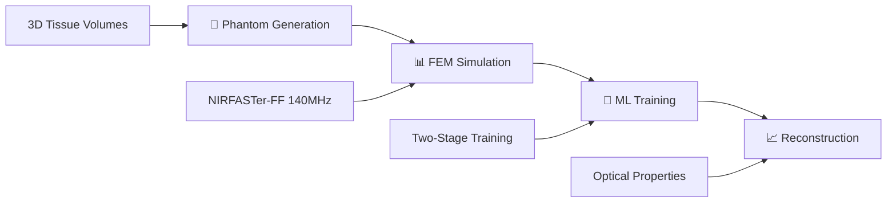

# 🔬 NIR-DOT Reconstruction
## Hybrid CNN-Transformer Architecture for Medical Imaging

> **Near-Infrared Diffuse Optical Tomography with Advanced Deep Learning**  
> *MSc Machine Learning & Artificial Intelligence • University of Birmingham*  
> **Student ID:** `mah422`

---

## ⚡ Core Innovation

**Solving the inverse problem in biomedical optics:** Reconstructing 3D tissue optical properties from surface NIR measurements using a novel **two-stage hybrid architecture** that combines CNN spatial learning with Transformer sequence modeling.

### 🎯 **Key Breakthroughs**
```
🧠 Two-Stage Learning    →  CNN pre-training + Transformer enhancement
🔬 Physics-Informed AI   →  NIRFASTer-FF finite element simulations  
🎪 Tissue Context        →  Anatomical patch integration for accuracy
🏥 Clinical Realism      →  Surface-constrained probe placement
```

---

## 🏗️ **System Architecture**

### **Complete Processing Pipeline**


### **🤖 Model Architecture**

#### **Stage 1: CNN Autoencoder**
```yaml
Input:  Surface measurements (N_probes × 3_detectors)
        ↓
Encoder: 3D CNN with residual blocks
        ├── Progressive downsampling
        ├── Feature extraction: 64 → 128 → 256 → 512 channels
        └── Latent representation: Compressed spatial features
        ↓
Decoder: 3D CNN upsampling
        ├── Transposed convolutions: 512 → 256 → 128 → 64
        ├── Skip connections for detail preservation
        └── Final reconstruction layer
        ↓
Output: Optical property maps [μₐ, μₛ'] → (60, 60, 60, 2)
```

#### **Stage 2: Hybrid CNN-Transformer**
```yaml
Input:  Surface measurements + Optional tissue patches
        ↓
Frozen CNN Encoder: Pre-trained spatial feature extraction
        ↓
Transformer Stack:
        ├── Multi-head self-attention (12 heads)
        ├── 6 transformer layers × 768-dim embeddings
        ├── Positional encoding for spatial relationships
        └── Feed-forward networks with residual connections
        ↓
Tissue Context (Optional):
        ├── 7×7×7 local patches around optodes
        ├── Separate transformer processing
        └── Feature fusion with measurements
        ↓
Enhanced Decoder: Context-aware reconstruction
        ↓
Output: Improved reconstruction with contextual understanding
```

---

## 🧬 **Data Generation & Physics**

### **Phantom Construction Engine**
| Component | Implementation | Purpose |
|-----------|---------------|---------|
| **Volumetric Modeling** | Air background + ellipsoidal tissues | Realistic anatomical structure |
| **Randomized Geometry** | 3D rotation matrices | Eliminate directional bias |
| **Tumor Embedding** | 80% tissue overlap constraint | Prevent unrealistic placement |
| **Surface Extraction** | Binary morphological operations | Clinical probe positioning |

### **NIRFASTer-FF Physics Simulation**
```python
# Frequency-Domain Diffusion Equation
-∇·(D∇Φ) + [μₐ + iω/c]Φ = S(r)

where:
    D     = Diffusion coefficient (tissue-dependent)
    Φ     = Complex photon fluence (amplitude + phase)
    μₐ    = Absorption coefficient
    μₛ'   = Reduced scattering coefficient  
    ω     = 140MHz modulation frequency
    S(r)  = Source terms at probe positions
```

#### **Optical Properties**
| Tissue Type | μₐ (mm⁻¹) | μₛ' (mm⁻¹) | Clinical Relevance |
|-------------|-----------|------------|-------------------|
| **Healthy** | 0.01 | 1.0 | Normal tissue baseline |
| **Tumor** | 0.02 | 0.8 | Enhanced vascularization |

### **Dataset Specifications**
- **📊 Scale:** 200+ phantom geometries for training diversity
- **🎯 Resolution:** 60³ voxel reconstruction (sub-millimeter precision)  
- **📡 Measurements:** 500 sources × 3 detectors = 1,500 data points/phantom
- **💾 Format:** HDF5 archives with lazy loading optimization
- **📈 Ground Truth:** Complete optical property maps for supervision

---

## 🎓 **Technical Implementation Details**

### **Machine Learning Components**

#### **🔗 CNN Autoencoder (Stage 1)**
```python
Architecture: 3D ResNet-style encoder-decoder
├── Residual blocks: Prevent vanishing gradients
├── Progressive scaling: 1→64→128→256→512 channels  
├── Skip connections: Preserve spatial details
└── Loss function: RMSE optimization with Adam
```

#### **🔄 Transformer Enhancement (Stage 2)**
```python
Multi-head Attention: 12 heads capture spatial relationships
├── Positional encoding: Sinusoidal spatial patterns
├── Layer normalization: Stable deep network training
├── Feed-forward networks: 768→3072→768 dimensions
└── Residual connections: Skip connections for deep learning
```

#### **🧠 Tissue Context Integration**
```python
Patch Extraction: 7×7×7 regions around source/detector pairs
├── Local anatomical constraints
├── Separate transformer processing  
├── Feature fusion mechanisms
└── Clinical guidance for reconstruction
```

### **Physics & Forward Modeling**

#### **Finite Element Implementation**
- **🔺 Mesh Generation:** Adaptive tetrahedral discretization (CGAL)
- **🌊 Boundary Conditions:** Robin-type at tissue-air interfaces  
- **⚡ Solver:** Sparse matrix factorization for complex systems
- **✅ Validation:** Analytical solution comparison in homogeneous media

#### **Measurement Processing**
- **📊 Log-amplitude transformation:** Stable numerical representation  
- **📐 Phase extraction:** 140MHz modulation information
- **🔊 Noise modeling:** Realistic amplitude/phase noise injection
- **🔧 Preprocessing:** Normalization and outlier handling

---

## 📁 **Codebase Architecture**

```
mah422/
├── � code/
│   ├── data_processing/
│   │   ├── data_simulator.py       # NIRFASTer-FF phantom generation
│   │   ├── data_loader.py          # PyTorch dataset + tissue patches  
│   │   └── data_analysis.py        # EDA and visualization tools
│   ├── models/
│   │   ├── hybrid_model.py         # Main CNN-Transformer architecture
│   │   ├── cnn_autoencoder.py      # Stage 1: Spatial learning
│   │   ├── transformer_encoder.py  # Stage 2: Sequence modeling
│   │   └── tissue_context_encoder.py # Anatomical constraints
│   ├── training/
│   │   ├── train_hybrid_model.py   # Complete training pipeline
│   │   ├── stage1_trainer.py       # CNN pre-training logic
│   │   └── stage2_trainer.py       # Transformer enhancement
│   └── utils/
│       └── logging_config.py       # Centralized experiment tracking
├── 📖 papers/                      # Research literature  
├── 🔬 research/                    # Analysis notebooks
└── 📋 requirements.txt             # Dependencies
```

---

## � **Key Features & Innovations**

<table>
<tr>
<td width="50%">

### **🔬 Physics-Informed Design**
- **Realistic FEM simulations** with 140MHz modulation  
- **Clinical probe constraints** on tissue surfaces
- **Noise modeling** matching experimental conditions
- **Physiological parameters** from literature

</td>
<td width="50%">

### **🤖 Advanced ML Architecture**  
- **Two-stage paradigm** with systematic pre-training
- **Multi-head attention** for spatial dependencies
- **Residual connections** in deep 3D networks  
- **Context integration** with tissue patches

</td>
</tr>
<tr>
<td width="50%">

### **📈 Performance Optimizations**
- **HDF5 lazy loading** with cross-phantom shuffling
- **Gradient checkpointing** for memory efficiency  
- **CUDA acceleration** for all model components
- **Modular architecture** supporting ablation studies

</td>
<td width="50%">

### **🎯 Clinical Relevance**
- **Surface measurements** mimic real DOT systems
- **Tissue heterogeneity** with multiple tissue types
- **Tumor detection** for early-stage diagnosis
- **Biomarker quantification** for characterization

</td>
</tr>
</table>

---

## 🏆 **Research Contributions**

### **Methodological Advances**
1. **🔄 Hybrid Architecture** → Novel CNN-Transformer combination for 3D reconstruction
2. **📚 Two-Stage Training** → Systematic pre-training approach for convergence  
3. **🧠 Tissue Context Integration** → Anatomical constraints for enhanced accuracy
4. **🔬 Physics-Informed Simulation** → Comprehensive FEM modeling with realistic phantoms

### **Technical Innovations**  
- **🎯 Surface-aware probe placement** → Clinical realism in synthetic data
- **📈 Multi-scale feature learning** → Progressive spatial representations
- **🔍 Attention-based reconstruction** → Long-range 3D dependency modeling  
- **⚙️ Efficient training pipeline** → Modular design for systematic evaluation

### **Clinical Impact**
- **🏥 Non-invasive imaging** → Advancing DOT technology for medical applications
- **🎯 Enhanced tumor detection** → Improved contrast recovery capabilities
- **⚡ Real-time potential** → Optimized inference for clinical deployment
- **📊 Biomarker quantification** → Accurate tissue characterization

---

## � **Technical Stack**

| Component | Technology | Version | Purpose |
|-----------|------------|---------|---------|
| **Deep Learning** | PyTorch | 2.7.1 | Neural network framework |
| **Physics Simulation** | NIRFASTer-FF | Latest | Finite element modeling |
| **Scientific Computing** | NumPy/SciPy | Latest | Mathematical operations |
| **Data Storage** | HDF5 | 3.14.0 | Efficient dataset management |
| **Visualization** | Matplotlib | 3.10.3 | Analysis and plotting |

### **System Requirements**
- **🐍 Python:** 3.12+ recommended
- **💾 Memory:** 16GB+ RAM for large datasets  
- **🚀 GPU:** CUDA-compatible for training acceleration
- **💿 Storage:** ~5GB for complete dataset + checkpoints

---

*Advanced biomedical imaging through the intersection of physics simulation and deep learning.*
