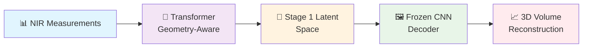

# 🔬 Hybrid CNN-Transformer for NIR-DOT Reconstruction

<div align="center">


<h3>🎯 Towards Generalisable Inverse Modelling for Frequency-Domain DOT<br/>via a Hybrid CNN–Transformer</h3>

[](https://www.python.org/)
[](https://pytorch.org/)
[](./LICENSE)
[](https://wandb.ai/)

**Robust, layout-agnostic deep learning for diffuse optical tomography reconstruction**  
*Two-stage architecture: autoencoder spatial prior + transformer geometry mapping*

[🚀 Quick Start](#-quickstart) • 
[📖 Documentation](#-documentation) • 
[🔬 Research](#-research) • 
[🤝 Contributing](#-contributing)

---

</div>

## 🌟 Overview

> **Revolutionary approach to NIR-DOT reconstruction combining the spatial learning power of CNNs with the geometric awareness of transformers.**

This repository implements a novel **two-stage deep learning pipeline** for Near-Infrared Diffuse Optical Tomography (NIR-DOT) reconstruction:

### 🏗️ Architecture Overview

<div align="center">



</div>

Our hybrid architecture combines the spatial learning capabilities of CNNs with transformer attention mechanisms for geometry-aware reconstruction:

<div align="center">

<br/><em>Two-stage architecture: Stage 1 learns spatial priors, Stage 2 maps measurements to latent space</em>
</div>

### ✨ Key Features

- 🎯 **Two-Stage Learning**: Decoupled spatial and geometric learning
- 🧠 **Transformer Innovation**: Applies transformer attention to DOT inverse problems  
- 📏 **Geometry Awareness**: Source-detector coordinate integration
- 🔄 **Layout Agnostic**: Generalizes across different probe configurations
- 🎛️ **Configurable Pipeline**: Easy stage switching and hyperparameter tuning

---

## 📁 Repository Structure

<details>
<summary>🗂️ <strong>Explore the codebase structure</strong></summary>

```
mah422/                             # 🏠 Root directory
├── 📊 analysis_results/            # Analysis visualizations
│   └── cross_dataset_analysis_10000_phantoms.png
├── 💾 checkpoints/                 # Model checkpoints
│   ├── checkpoint_stage1_*.pt
│   └── checkpoint_stage2_*.pt
├── 🧬 code/                        # Core implementation (~14k LOC)
│   ├── 📊 data_processing/         # Data generation & loading
│   │   ├── data_loader.py         # PyTorch DataLoaders
│   │   └── data_simulator.py      # Phantom simulation
│   ├── 🏗️ models/                  # Neural architectures
│   │   ├── cnn_autoencoder.py     # 3D CNN autoencoder
│   │   ├── transformer_encoder.py # Transformer components
│   │   ├── hybrid_model.py        # Combined architecture
│   │   ├── global_pooling_encoder.py # Global feature extraction
│   │   └── spatially_aware_embedding.py  # Geometry processing
│   ├── 🎯 training/                # Training pipelines
│   │   ├── train_hybrid_model.py  # Main training entry point
│   │   ├── stage1_trainer.py      # CNN pretraining
│   │   ├── stage2_trainer.py      # Transformer training
│   │   ├── training_config.py     # Hyperparameters
│   │   ├── training_utils.py      # Training utilities
│   │   ├── latent_stats.py        # Latent space analysis
│   │   └── teacher_stage1.py      # Teacher model wrapper
│   └── 🔧 utils/                   # Utilities & metrics
│       ├── metrics.py             # Evaluation metrics
│       ├── standardizers.py       # Data normalization
│       ├── viz_recon.py          # Visualization
│       └── logging_config.py      # Centralized logging
├── 💾 data/                        # Generated datasets (HDF5)
├── 📊 figs/                        # Static figures
├── 📝 logs/                        # Training logs
├── 🔧 nirfaster-FF/               # Forward modeling library
├── ⚙️ setup/                       # Environment setup
│   ├── requirements.txt          # Python dependencies
│   └── bootstrap_lambdalabs.sh   # Remote setup script
└── 📊 wandb/                      # W&B experiment tracking
```

</details>

---

## 🚀 Quickstart

### 1️⃣ Environment Setup

<details>
<summary>💻 <strong>Local Development</strong></summary>

```bash
# Clone the repository
git clone https://github.com/maxhartml/mah422.git
cd mah422

# Create virtual environment
python3 -m venv env_diss
source env_diss/bin/activate  # Windows: env_diss\Scripts\activate

# Install dependencies
pip install -r setup/requirements.txt
```

</details>

<details>
<summary>☁️ <strong>Remote Training (Vast.ai/LambdaLabs)</strong></summary>

```bash
# SSH into remote instance
ssh -p <PORT> <USER>@<IP>

# Quick setup
git clone https://github.com/maxhartml/mah422.git && cd mah422
source setup/bootstrap_lambdalabs.sh  # Auto-setup script

# Start persistent session
tmux new -s nir-dot-training
```

</details>

### 2️⃣ Data Generation

```bash
# Generate synthetic phantom dataset
python -m code.data_processing.data_simulator

# Expected output structure:
# data/phantom_001/phantom_001_scan.h5  # Measurements + ground truth
# data/phantom_002/phantom_002_scan.h5
# ...
```

### 3️⃣ Training Pipeline

<div align="center">

**🎯 Stage 1: CNN Autoencoder**

</div>

```bash
# Configure Stage 1 in training_config.py
# CURRENT_TRAINING_STAGE = "stage1"

python -m code.training.train_hybrid_model
```

<div align="center">

**🧠 Stage 2: Transformer**

</div>

```bash  
# Configure Stage 2 in training_config.py
# CURRENT_TRAINING_STAGE = "stage2" 

python -m code.training.train_hybrid_model
```

### 4️⃣ Results & Monitoring

- 📊 **Checkpoints**: `checkpoints/checkpoint_stage*_*.pt`
- 📝 **Logs**: `logs/training/` and `logs/data_processing/`
- 🔍 **W&B Tracking**: Optional project `nir-dot-reconstruction`

---

## 🔧 Configuration & Training

### ⚙️ Key Configuration Parameters

<details>
<summary>🎛️ <strong>Training Configuration</strong> (training_config.py)</summary>

```python
# Stage Control
CURRENT_TRAINING_STAGE = "stage1"  # or "stage2"

# Architecture 
LATENT_DIM = 256                    # Latent space dimension
EMBED_DIM = 256                     # Transformer embedding dim
N_MEASUREMENTS = 256                # Subsampled measurements per phantom

# Training
STAGE1_EPOCHS = 150                 # CNN pretraining epochs  
STAGE2_EPOCHS = 100                 # Transformer training epochs
BATCH_SIZE = 4                      # Batch size (memory dependent)

# Optimization
STAGE1_BASE_LR = 1e-4              # CNN base learning rate
STAGE2_BASE_LR = 5e-5              # Transformer base learning rate
USE_EMA = True                     # Exponential moving average
```

</details>

---

## 🔬 Research & Innovation

### 📚 Scientific Contributions

1. **🏗️ Novel Two-Stage Architecture**: Decoupled spatial and geometric learning for improved generalization
2. **🧠 Transformer for DOT**: Applies transformer attention mechanisms to DOT inverse problems  
3. **📏 Geometry Integration**: Source-detector coordinate awareness for layout-agnostic reconstruction
4. **📊 Comprehensive Evaluation**: Physics-based metrics in raw units with proper statistical reporting

### 🎓 Academic Context

<details>
<summary>📖 <strong>Citation & Publication</strong></summary>

```bibtex
@mastersthesis{hart2025nir_dot_hybrid,
  title={Towards Generalisable Inverse Modelling for Frequency-Domain Diffuse Optical Tomography via a Hybrid CNN–Transformer},
  author={Max Andrew Hart},
  school={University of Birmingham},  
  year={2025},
  type={MSc Dissertation},
  note={AI and Machine Learning}
}
```

</details>

### 🔗 References & Acknowledgements

- **NIRFASTer-FF**: Forward modeling framework ([GitHub](https://github.com/milabuob/nirfaster-FF))
- **University of Birmingham**: Computer Science Department
- **Vast.ai**: GPU compute platform for training

#### 🙏 Special Acknowledgements

- **Dr. Hamid Dehghani**: Supervisor and research guidance
- **Dr Robin Dale**: Foundational work this research builds upon

---

## 🛠️ Development & Contributing

### 🤝 Contributing

We welcome contributions! Please see our contribution guidelines:

1. 🍴 Fork the repository
2. 🌟 Create a feature branch (`git checkout -b feature/amazing-feature`)
3. 💫 Commit changes (`git commit -m 'Add amazing feature'`)
4. 🚀 Push to branch (`git push origin feature/amazing-feature`)
5. 🔄 Open a Pull Request

---

## 📋 Requirements & Compatibility

### 💻 System Requirements

- **Python**: 3.10+ 
- **GPU**: CUDA-capable GPU (recommended: 16GB+ VRAM)
- **RAM**: 32GB+ for full dataset training
- **Storage**: 50GB+ for datasets and checkpoints

### 📦 Dependencies

<details>
<summary>🔍 <strong>Key Packages</strong></summary>

```yaml
Core ML/DL:
  - torch: 2.5.1
  - numpy: 1.26.4

Data & Visualization:  
  - h5py: 3.10.0
  - matplotlib: 3.8.2
  - scipy: 1.11.4

ML Tools:
  - scikit-learn: 1.3.2
  - wandb: 0.16.1 (optional)

Utilities:
  - psutil: 5.9.6
```

</details>

---

## 📞 Support & Community

### 💬 Get Help

- 📧 **Email**: [maxhartml@outlook.com](mailto:maxhartml@outlook.com)
- 🐛 **Issues**: [GitHub Issues](https://github.com/maxhartml/mah422/issues)
- 💡 **Discussions**: [GitHub Discussions](https://github.com/maxhartml/mah422/discussions)

### 🏷️ Version Information

- **Latest Release**: v1.0.0
- **Total Commits**: 207+ 
- **Main Branch**: `main`
- **License**: MIT

---

<div align="center">

### 🎉 Thank you for your interest in our NIR-DOT research!

**Star ⭐ this repository if you find it helpful!**

*Made with ❤️ at the University of Birmingham*

---

[](https://github.com/maxhartml/mah422/stargazers)
[](https://github.com/maxhartml/mah422/network/members)

</div>