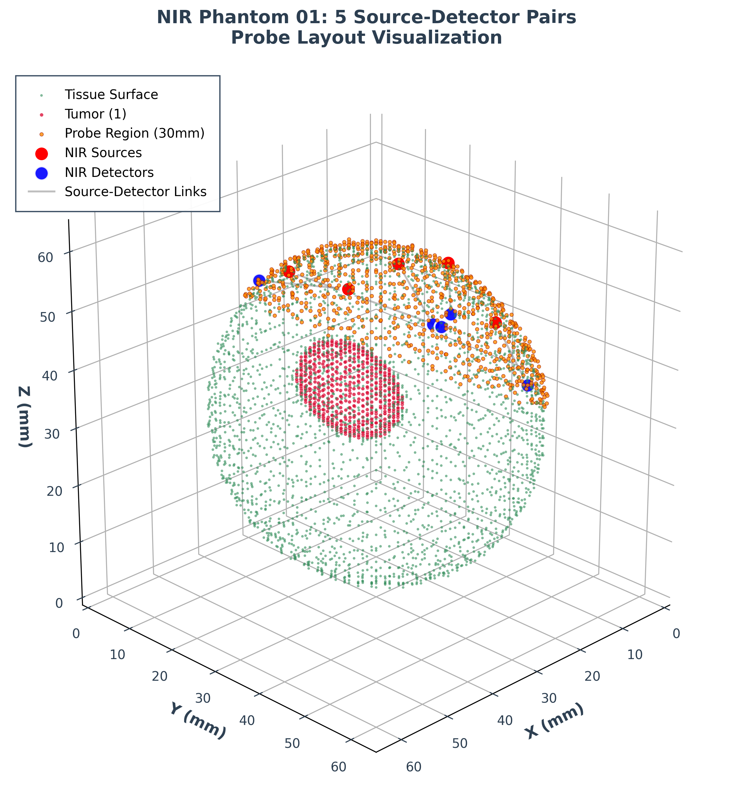
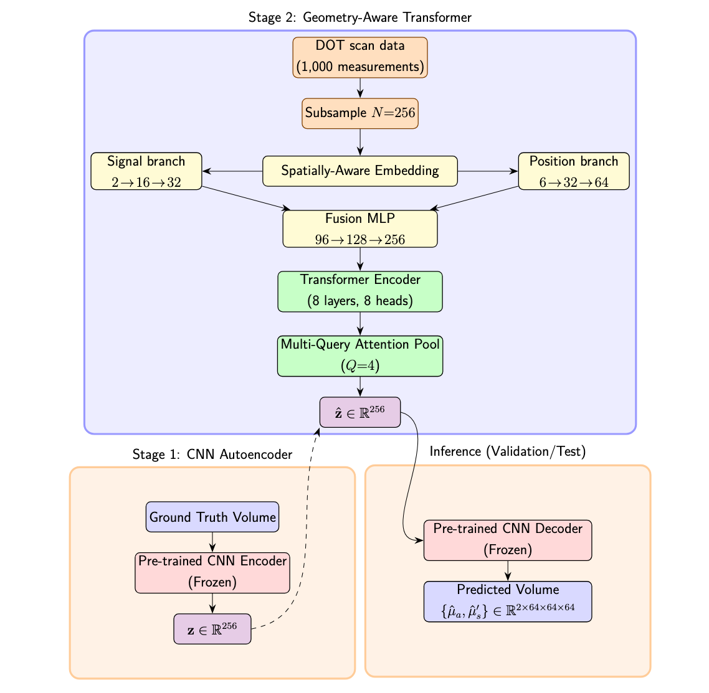

<div align="center">



<h3>🎯 Towards Generalisable Inverse Modelling for Frequency-Domain DOT<br/>via a Hybrid CNN–Transformer</h3>

[](https://www.python.org/)
[](https://pytorch.org/)
[](./LICENSE)
[](https://wandb.ai/)

**Robust, layout-agnostic deep learning for diffuse optical tomography reconstruction**  
*Two-stage architecture: autoencoder spatial prior + transformer geometry mapping*

[🚀 Quick Start](#-quickstart) • 
[📖 Documentation](#-documentation) • 
[🔬 Research](#-research) • 
[🤝 Contributing](#-contributing)

---

</div>

## 🌟 Overview

> **Revolutionary approach to NIR-DOT reconstruction combining the spatial learning power of CNNs with the geometric awareness of transformers.**

This repository implements a **two-stage deep learning pipeline** for Near-Infrared Diffuse Optical Tomography (NIR-DOT) reconstruction, designed to achieve robust, layout-agnostic medical imaging reconstruction.

<br/>

### ✨ Key Features

<div align="center">

| 🎯 **Two-Stage Learning** | 🧠 **Transformer Innovation** | 📏 **Geometry Awareness** |
|:-------------------------:|:-----------------------------:|:-------------------------:|
| Decoupled spatial and geometric learning | Applies transformer attention to DOT inverse problems | Source-detector coordinate integration |
| **🔄 Layout Agnostic** | **🎛️ Configurable Pipeline** | **🚀 High Performance** |
| Generalizes across different probe configurations | Easy stage switching and hyperparameter tuning | Optimized for GPU training with mixed precision |

</div>

<br/>

---

## 🏗️ Architecture Overview

<div align="center">

**Our hybrid architecture seamlessly integrates CNN spatial learning with transformer geometric awareness**

<br/>



<br/>

*🎯 **Stage 1**: CNN Autoencoder learns robust spatial priors from 3D volumes*  
*🧠 **Stage 2**: Transformer maps NIR measurements to latent space with geometry awareness*

</div>

<br/>

---

## 📁 Repository Structure

🗂️ **Explore the codebase structure**

```
mah422/                             # 🏠 Root directory
├── 💾 checkpoints/                 # Model checkpoints
│   ├── checkpoint_stage1_*.pt
│   └── checkpoint_stage2_*.pt
├── 🧬 code/                        # Core implementation (~14k LOC)
│   ├── 📊 data_processing/         # Data generation & loading
│   │   ├── data_loader.py         # PyTorch DataLoaders
│   │   └── data_simulator.py      # Phantom simulation
│   ├── 🏗️ models/                  # Neural architectures
│   │   ├── cnn_autoencoder.py     # 3D CNN autoencoder
│   │   ├── transformer_encoder.py # Transformer components
│   │   ├── hybrid_model.py        # Combined architecture
│   │   ├── global_pooling_encoder.py # Global feature extraction
│   │   └── spatially_aware_embedding.py  # Geometry processing
│   ├── 🎯 training/                # Training pipelines
│   │   ├── train_hybrid_model.py  # Main training entry point
│   │   ├── stage1_trainer.py      # CNN pretraining
│   │   ├── stage2_trainer.py      # Transformer training
│   │   ├── training_config.py     # Hyperparameters
│   │   ├── training_utils.py      # Training utilities
│   │   ├── latent_stats.py        # Latent space analysis
│   │   └── teacher_stage1.py      # Teacher model wrapper
│   └── 🔧 utils/                   # Utilities & metrics
│       ├── metrics.py             # Evaluation metrics
│       ├── standardizers.py       # Data normalization
│       ├── viz_recon.py          # Visualization
│       └── logging_config.py      # Centralized logging
├── 💾 data/                        # Generated datasets (HDF5)
├── 📊 figs/                        # Static figures
├── 📝 logs/                        # Training logs
├── 🔧 nirfaster-FF/               # Forward modeling library
├── ⚙️ setup/                       # Environment setup
│   ├── requirements.txt          # Python dependencies
│   └── bootstrap_lambdalabs.sh   # Remote setup script
└── 📊 wandb/                      # W&B experiment tracking
```

---

## 🚀 Quickstart

<div align="center">

**⚡ Get up and running in under 5 minutes**

</div>

<br/>

### 1️⃣ Environment Setup

<table>
<tr>
<td width="50%">

**💻 Local Development**

```bash
# Clone the repository
git clone https://github.com/maxhartml/mah422.git
cd mah422

# Create virtual environment
python3 -m venv env_diss
source env_diss/bin/activate

# Install dependencies
pip install -r setup/requirements.txt
```

</td>
<td width="50%">

**☁️ Remote Training**

```bash
# SSH into remote instance
ssh -p <PORT> <USER>@<IP>

# Quick setup
git clone https://github.com/maxhartml/mah422.git && cd mah422
source setup/bootstrap_lambdalabs.sh

# Start persistent session
tmux new -s nir-dot-training
```

</td>
</tr>
</table>

<br/>

### 2️⃣ Data Generation

```bash
# Generate synthetic phantom dataset
python -m code.data_processing.data_simulator

# Expected output structure:
# data/phantom_001/phantom_001_scan.h5  # Measurements + ground truth
# data/phantom_002/phantom_002_scan.h5
# ...
```

<br/>

### 3️⃣ Training Pipeline

<div align="center">

<table>
<tr>
<td width="50%" align="center">

**🎯 Stage 1: CNN Autoencoder**

```bash
# Configure Stage 1 in training_config.py
# CURRENT_TRAINING_STAGE = "stage1"

python -m code.training.train_hybrid_model
```

*Learns robust spatial priors from 3D volumes*

</td>
<td width="50%" align="center">

**🧠 Stage 2: Transformer**

```bash  
# Configure Stage 2 in training_config.py
# CURRENT_TRAINING_STAGE = "stage2" 

python -m code.training.train_hybrid_model
```

*Maps NIR measurements to learned latent space*

</td>
</tr>
</table>

</div>

<br/>

### 4️⃣ Results & Monitoring

<div align="center">

| 📊 **Checkpoints** | 📝 **Logs** | 🔍 **Tracking** |
|:------------------:|:-----------:|:---------------:|
| `checkpoints/checkpoint_stage*_*.pt` | `logs/training/` | W&B: `nir-dot-reconstruction` |
| Model states saved automatically | Training & data processing logs | Optional experiment tracking |

</div>

---

## 🔧 Configuration & Training

<div align="center">

**⚙️ Fine-tune your training with comprehensive configuration options**

</div>

<br/>

### 🎛️ Key Configuration Parameters

<div align="center">

<table>
<tr>
<td width="33%" align="center">

**🏗️ Architecture**

```python
LATENT_DIM = 256
EMBED_DIM = 256
N_MEASUREMENTS = 256
```

*Core model dimensions*

</td>
<td width="33%" align="center">

**� Training**

```python
STAGE1_EPOCHS = 150
STAGE2_EPOCHS = 100
BATCH_SIZE = 4
```

*Training hyperparameters*

</td>
<td width="33%" align="center">

**⚡ Optimization**

```python
STAGE1_BASE_LR = 1e-4
STAGE2_BASE_LR = 5e-5
USE_EMA = True
```

*Learning & optimization*

</td>
</tr>
</table>

</div>

📋 **Complete Configuration Reference** (training_config.py)

```python
# Stage Control
CURRENT_TRAINING_STAGE = "stage1"  # or "stage2"

# Architecture 
LATENT_DIM = 256                    # Latent space dimension
EMBED_DIM = 256                     # Transformer embedding dim
N_MEASUREMENTS = 256                # Subsampled measurements per phantom

# Training
STAGE1_EPOCHS = 150                 # CNN pretraining epochs  
STAGE2_EPOCHS = 100                 # Transformer training epochs
BATCH_SIZE = 4                      # Batch size (memory dependent)

# Optimization
STAGE1_BASE_LR = 1e-4              # CNN base learning rate
STAGE2_BASE_LR = 5e-5              # Transformer base learning rate
USE_EMA = True                     # Exponential moving average
```

<br/>

---

## 🔬 Research & Innovation

<div align="center">

**🎓 Academic contributions to medical imaging and deep learning**

</div>

<br/>

### 📚 Scientific Contributions

<div align="center">

<table>
<tr>
<td width="50%" align="center">

**🏗️ Novel Two-Stage Architecture**  
Decoupled spatial and geometric learning for improved generalization

**🧠 Transformer for DOT**  
Applies transformer attention mechanisms to DOT inverse problems

</td>
<td width="50%" align="center">

**📏 Geometry Integration**  
Source-detector coordinate awareness for layout-agnostic reconstruction

**📊 Comprehensive Evaluation**  
Physics-based metrics in raw units with proper statistical reporting

</td>
</tr>
</table>

</div>

<br/>

### 🎓 Academic Context

📖 **Citation & Publication**

```bibtex
@mastersthesis{hart2025nir_dot_hybrid,
  title={Towards Generalisable Inverse Modelling for Frequency-Domain Diffuse Optical Tomography via a Hybrid CNN–Transformer},
  author={Max Andrew Hart},
  school={University of Birmingham},  
  year={2025},
  type={MSc Dissertation},
  note={AI and Machine Learning}
}
```

<br/>

### 🔗 References & Acknowledgements

<div align="center">

<table>
<tr>
<td width="33%" align="center">

**🛠️ Technical**
- NIRFASTer-FF Framework
- University of Birmingham
- Vast.ai GPU Platform

</td>
<td width="33%" align="center">

**🙏 Supervision**
- **Dr. Hamid Dehghani**
- Research guidance & supervision

</td>
<td width="33%" align="center">

**📚 Foundation**
- **Dr. Robin Dale**
- Foundational work & research base

</td>
</tr>
</table>

</div>

<br/>

---

## 🛠️ Development & Contributing

### 🤝 Contributing

We welcome contributions! Please see our contribution guidelines:

1. 🍴 Fork the repository
2. 🌟 Create a feature branch (`git checkout -b feature/amazing-feature`)
3. 💫 Commit changes (`git commit -m 'Add amazing feature'`)
4. 🚀 Push to branch (`git push origin feature/amazing-feature`)
5. 🔄 Open a Pull Request

---

## 📋 Requirements & Compatibility

<div align="center">

**💻 System specifications and dependency overview**

</div>

<br/>

### �️ System Requirements

<div align="center">

<table>
<tr>
<td width="25%" align="center">

**🐍 Python**  
3.10+

</td>
<td width="25%" align="center">

**🚀 GPU**  
CUDA-capable  
(16GB+ VRAM)

</td>
<td width="25%" align="center">

**💾 RAM**  
32GB+  
for full datasets

</td>
<td width="25%" align="center">

**💿 Storage**  
10GB+  
datasets & checkpoints

</td>
</tr>
</table>

</div>

<br/>

### 📦 Key Dependencies

🔍 **Complete Package List**

<div align="center">

<table>
<tr>
<td width="33%">

**🧠 Core ML/DL**
- `torch: 2.5.1`
- `numpy: 1.26.4`

</td>
<td width="33%">

**📊 Data & Visualization**  
- `h5py: 3.10.0`
- `matplotlib: 3.8.2`
- `scipy: 1.11.4`

</td>
<td width="33%">

**🛠️ ML Tools**
- `scikit-learn: 1.3.2`
- `wandb: 0.16.1` (optional)
- `psutil: 5.9.6`

</td>
</tr>
</table>

</div>

<br/>

---

## 📞 Support & Community

<div align="center">

**💬 Connect with us for support, questions, and contributions**

</div>

<br/>

### 🤝 Get Help & Contribute

<div align="center">

<table>
<tr>
<td width="33%" align="center">

**📧 Contact**  
[maxhartml@outlook.com](mailto:maxhartml@outlook.com)  

*Direct email support*

</td>
<td width="33%" align="center">

**🐛 Issues**  
[GitHub Issues](https://github.com/maxhartml/mah422/issues)  

*Bug reports & feature requests*

</td>
<td width="33%" align="center">

**💡 Discussions**  
[GitHub Discussions](https://github.com/maxhartml/mah422/discussions)  

*Community Q&A*

</td>
</tr>
</table>

</div>

<br/>

### 🏷️ Project Information

<div align="center">

| **Latest Release** | **Total Commits** | **Main Branch** | **License** |
|:------------------:|:-----------------:|:---------------:|:-----------:|
| v1.0.0 | 207+ | `main` | MIT |

</div>

<br/>

---

<div align="center">

### 🎉 Thank you for your interest in our NIR-DOT research!

**If this work helps your research, please ⭐ star this repository!**

<br/>

*Made with ❤️ at the University of Birmingham*

</div>