# 🎓 **Complete NIR-DOT Hybrid Architecture Deep Dive**
## *A Comprehensive Technical Walkthrough*

<div align="center">


**Welcome to the definitive guide to your NIR-DOT reconstruction system!**  
*Let's explore every tensor, every transformation, and every architectural decision in your hybrid CNN-Transformer pipeline.*

</div>

---

## 📚 **Table of Contents**

- [🏗️ System Overview & Philosophy](#system-overview)
- [📊 Data Pipeline Deep Dive](#data-pipeline)
- [🏛️ Stage 1: CNN Autoencoder Mastery](#stage1-deep-dive)
- [🤖 Stage 2: Transformer Enhancement](#stage2-deep-dive)
- [🔄 Baseline vs Enhanced Modes](#baseline-vs-enhanced)
- [🎯 Fixed Sequence Undersampling Strategy](#undersampling-strategy)
- [🏋️ Training Pipeline Architecture](#training-pipeline)
- [📊 Metrics & Evaluation](#metrics-evaluation)
- [🎯 Key Architectural Insights](#key-insights)

---

## 🏗️ **System Overview & Philosophy** {#system-overview}

### **The Two-Stage Learning Paradigm**

Your system implements a sophisticated **progressive learning strategy** inspired by Robin Dale's ECBO 2025 research:


<div align="center">

| **Stage** | **Input** | **Output** | **Purpose** |
|-----------|-----------|------------|-------------|
| **Stage 1** | Ground Truth → CNN → Ground Truth | Identity Mapping | Learn spatial representations |
| **Stage 2** | NIR Measurements → Enhanced Transformer → CNN Decoder | Measurement → Spatial Mapping | Learn measurement interpretation |

</div>

### **Why This Two-Stage Approach?**

> 🎯 **Stage 1 Problem**: CNNs excel at spatial patterns but need good initial representations  
> ✅ **Stage 1 Solution**: Learn robust spatial feature extraction through identity mapping  
> 🎯 **Stage 2 Problem**: How to map unstructured NIR measurements to spatial representations?  
> ✅ **Stage 2 Solution**: Use transformer to learn measurement→spatial mapping, leveraging frozen CNN decoder

---

## 📊 **Data Pipeline Deep Dive** {#data-pipeline}

### **Data Structure & Dimensions**

Let's trace exactly how your data flows through the system:

```python
# Raw Phantom Data (from HDF5 files)
phantom_data = {
    'log_amplitude': np.array([1000])      # [1000] measurements per phantom
    'phase': np.array([1000])              # [1000] phase measurements  
    'source_positions': np.array([1000, 3])  # [1000, 3] source coordinates
    'detector_positions': np.array([1000, 3]) # [1000, 3] detector coordinates
    'ground_truth': np.array([2, 64, 64, 64]) # [2, 64³] μₐ and μₛ volumes
}
```

### **Dataset Loading Strategy**

Your [`NIRPhantomDataset`](code/data_processing/data_loader.py) uses **stage-optimized loading**:

<div align="center">

### 🚀 **Memory Optimization**

| **Metric** | **Stage 1** | **Stage 2** | **Improvement** |
|------------|-------------|-------------|-----------------|
| Memory per phantom | 2.1 MB | 67.6 MB | **97% reduction** |
| Data loaded | Ground truth only | Full dataset | Optimized for purpose |

</div>

```python
# Stage 1: Memory-Optimized (97% reduction!)
def _load_stage1_data(self, phantom_idx):
    return {
        'ground_truth': torch.tensor([2, 64, 64, 64], dtype=torch.float32),
        'phantom_id': torch.tensor(phantom_idx, dtype=torch.long)
        # NO nir_measurements, NO tissue_patches → 2.1MB vs 67.6MB per phantom!
    }

# Stage 2: Full Data Loading
def _load_stage2_data(self, phantom_idx):
    return {
        'nir_measurements': torch.tensor([1000, 8], dtype=torch.float32),
        'ground_truth': torch.tensor([2, 64, 64, 64], dtype=torch.float32),
        'tissue_patches': torch.tensor([1000, 2, 2, 16, 16, 16], dtype=torch.float32),
        'phantom_id': torch.tensor(phantom_idx, dtype=torch.long)
    }
```

### **NIR Measurement Composition**

Each measurement is an **8-dimensional vector**:

<div align="center">

| **Index** | **Component** | **Description** | **Units** |
|-----------|---------------|-----------------|-----------|
| 0 | `log_amplitude` | ln(I_AC) - optical intensity | float |
| 1 | `phase` | φ - phase shift | radians |
| 2 | `source_x` | Source position x-coordinate | mm |
| 3 | `source_y` | Source position y-coordinate | mm |
| 4 | `source_z` | Source position z-coordinate | mm |
| 5 | `detector_x` | Detector position x-coordinate | mm |
| 6 | `detector_y` | Detector position y-coordinate | mm |
| 7 | `detector_z` | Detector position z-coordinate | mm |

**Total: [8] dimensions per measurement**

</div>

### **Tissue Patch Extraction**

The tissue patches provide **local anatomical context**:

```python
# For each measurement, extract 16³ patches around source and detector
tissue_patches_per_measurement = {
    'source_patch': ground_truth[:, src_z-8:src_z+8, src_y-8:src_y+8, src_x-8:src_x+8],
    'detector_patch': ground_truth[:, det_z-8:det_z+8, det_y-8:det_y+8, det_x-8:det_x+8]
}

# Final shape: [batch, 1000_measurements, 2_patches, 2_channels, 16, 16, 16]
```

---

## 🏛️ **Stage 1: CNN Autoencoder Mastery** {#stage1-deep-dive}

### **Architecture Philosophy**

> 💡 **Core Concept**: Stage 1 teaches the CNN to **understand spatial relationships** through identity mapping


<div align="center">

**Input**: Ground Truth Volume `[batch, 2, 64, 64, 64]`  
**Target**: Same Ground Truth Volume `[batch, 2, 64, 64, 64]`  
**Loss**: `RMSE(reconstruction, ground_truth)`

</div>

### **CNN Encoder Deep Dive**

Let's trace a batch through the encoder:

```python
# Input: [batch=4, channels=2, depth=64, height=64, width=64]
x = ground_truth  # [4, 2, 64, 64, 64]

# Stage 1: Initial Feature Extraction
x = initial_conv(x)  # [4, 16, 32, 32, 32]  ← 7×7×7 conv, stride=2, padding=3
x = maxpool(x)       # [4, 16, 16, 16, 16]  ← 3×3×3 maxpool, stride=2

# Stage 2-5: Progressive Feature Learning with Residual Blocks
x = layer1(x)        # [4, 32, 16, 16, 16]  ← ResBlock: 16→32 channels
x = layer2(x)        # [4, 64, 8, 8, 8]     ← ResBlock: 32→64, stride=2
x = layer3(x)        # [4, 128, 4, 4, 4]    ← ResBlock: 64→128, stride=2
x = layer4(x)        # [4, 256, 2, 2, 2]    ← ResBlock: 128→256, stride=2

# Stage 6: Global Feature Extraction
x = global_avg_pool(x)  # [4, 256, 1, 1, 1]  ← Adaptive average pooling
x = flatten(x)          # [4, 256]           ← Flatten spatial dimensions
x = dropout(x)          # [4, 256]           ← Regularization
x = feature_projection(x) # [4, 256]         ← Linear: 256→256 (configurable)

# Final encoded features: [4, 256]
```

<div align="center">

### 🔄 **Encoder Flow Visualization**

| **Layer** | **Input Shape** | **Output Shape** | **Operation** |
|-----------|-----------------|------------------|---------------|
| Initial Conv | `[4, 2, 64³]` | `[4, 16, 32³]` | 7×7×7 conv, stride=2 |
| MaxPool | `[4, 16, 32³]` | `[4, 16, 16³]` | 3×3×3 pool, stride=2 |
| ResBlock 1 | `[4, 16, 16³]` | `[4, 32, 16³]` | Channel expansion |
| ResBlock 2 | `[4, 32, 16³]` | `[4, 64, 8³]` | Stride=2 downsampling |
| ResBlock 3 | `[4, 64, 8³]` | `[4, 128, 4³]` | Stride=2 downsampling |
| ResBlock 4 | `[4, 128, 4³]` | `[4, 256, 2³]` | Stride=2 downsampling |
| Global Pool | `[4, 256, 2³]` | `[4, 256]` | Feature compression |

</div>

### **CNN Decoder Architecture**

The decoder performs **symmetric upsampling**:

```python
# Input: Encoded features [4, 256]
x = fc_expand(x)         # [4, 2048]          ← Linear: 256→256*8
x = reshape(x)           # [4, 256, 2, 2, 2]  ← Reshape to 3D

# Progressive Upsampling (exact mirror of encoder)
x = deconv1(x)           # [4, 128, 4, 4, 4]   ← TransConv: 256→128, stride=2
x = deconv2(x)           # [4, 64, 8, 8, 8]    ← TransConv: 128→64, stride=2
x = deconv3(x)           # [4, 32, 16, 16, 16]  ← TransConv: 64→32, stride=2
x = deconv4(x)           # [4, 32, 32, 32, 32]  ← TransConv: 32→32, stride=2
x = deconv5(x)           # [4, 16, 64, 64, 64]  ← TransConv: 32→16, stride=2

# Final reconstruction
x = final_conv(x)        # [4, 2, 64, 64, 64]  ← Conv: 16→2 channels

# Output: Reconstructed volume [4, 2, 64, 64, 64]
```

### **What Stage 1 Learns**

<div align="center">

🧠 **Spatial Feature Hierarchies**: Low-level edges → Mid-level textures → High-level structures  
🗜️ **Efficient Encoding**: Compress 64³×2 = 524,288 values → 256 features  
🔧 **Robust Decoding**: Reconstruct full spatial detail from compact representation

</div>

---

## 🤖 **Stage 2: Transformer Enhancement** {#stage2-deep-dive}

### **The Grand Architecture**

> 🎭 **Stage 2 is where the magic happens!** Let's trace the complete flow:

```mermaid
graph TD
    A[NIR Measurements<br/>1000×8] --> B[Fixed Undersampling<br/>256×8]
    B --> C[Spatially-Aware Embedding<br/>256×256]
    C --> D[Transformer Encoder<br/>256×256]
    D --> E[Global Pooling<br/>256]
    E --> F[CNN Decoder<br/>2×64³]
```



### **Fixed Sequence Undersampling (Your Innovation!)**

This is your brilliant solution to the tensor complexity problems:

```python
def fixed_sequence_undersampling(nir_measurements, tissue_patches=None, 
                                n_measurements=256, training=True):
    # Input: [batch=4, seq_len=1000, features=8]
    batch_size, seq_len, feature_dim = nir_measurements.shape  # [4, 1000, 8]
    
    if training:
        # Same random selection for ALL phantoms in batch (epoch-consistent)
        selected_indices = torch.randperm(1000)[:256].sort()[0]  # [256] sorted indices
    else:
        # Inference: always use first 256 for consistency
        selected_indices = torch.arange(256)
    
    # Apply same selection to all phantoms
    selected_nir = nir_measurements[:, selected_indices, :]  # [4, 256, 8]
    selected_tissue = tissue_patches[:, selected_indices, ...]  # [4, 256, 2, 2, 16³]
    
    return selected_nir, selected_tissue
```

<div align="center">

### ✨ **Why This Is Brilliant**

| **Benefit** | **Description** | **Impact** |
|-------------|-----------------|------------|
| ✅ **Consistent shapes** | Always `[batch, 256, ...]` | No padding/truncation headaches |
| ✅ **Data augmentation** | 3.9× more training combinations | C(1000,256) possibilities |
| ✅ **Memory efficient** | 256×256 attention matrices vs 1000×1000 | 92.9% memory savings |
| ✅ **No attention masking** | Eliminates complex masking logic | Simplified architecture |

</div>

### **Spatially-Aware Embedding Deep Dive**

This is your implementation of Robin Dale's architecture:

```python
class SpatiallyAwareEmbedding:
    def forward(self, nir_measurements):
        # Input: [batch=4, measurements=256, features=8]
        measurements = nir_measurements[:, :, :2]  # [4, 256, 2] ← log_amp, phase
        positions = nir_measurements[:, :, 2:]     # [4, 256, 6] ← x,y,z coords
        
        # Step 1: Measurement embedding (Robin's first FC layer)
        measurement_embedded = self.measurement_embedding(measurements)  # [4, 256, 256]
        
        # Step 2: Concatenate with positions
        concatenated = torch.cat([measurement_embedded, positions], dim=-1)  # [4, 256, 262]
        
        # Step 3: Combined projection (Robin's second FC layer)
        hi_tokens = self.combined_projection(concatenated)  # [4, 256, 256]
        hi_tokens = self.layer_norm(hi_tokens)              # [4, 256, 256]
        
        return hi_tokens  # [4, 256, 256] ← Ready for transformer!
```

### **Tissue Feature Processing (Enhanced Mode)**

When using tissue patches, you get measurement-specific anatomical context:

```python
class TissueFeatureExtractor:
    def process_tissue_patches(self, tissue_patches):
        # Input: [batch=4, measurements=256, patches=2, channels=2, 16, 16, 16]
        measurement_tissue_features = []
        
        for i in range(256):  # Process each measurement's patches
            # Get patches for measurement i
            source_patch = tissue_patches[:, i, 0, :, :, :, :]    # [4, 2, 16³]
            detector_patch = tissue_patches[:, i, 1, :, :, :, :]  # [4, 2, 16³]
            
            # Process through CNN
            source_features = self.patch_cnn(source_patch)     # [4, 128]
            detector_features = self.patch_cnn(detector_patch) # [4, 128]
            
            # Combine for this measurement
            combined = torch.cat([source_features, detector_features], dim=-1)  # [4, 256]
            measurement_tissue_features.append(combined)
        
        # Stack all measurements: [4, 256, 256]
        return torch.stack(measurement_tissue_features, dim=1)
    
    def fuse_with_measurements(self, hi_tokens, tissue_features):
        # Input: hi_tokens [4, 256, 256], tissue_features [4, 256, 256]
        # Concatenate measurement and tissue info
        combined = torch.cat([hi_tokens, tissue_features], dim=-1)  # [4, 256, 512]
        
        # Learned fusion network
        enhanced_tokens = self.fusion_layer(combined)  # [4, 256, 256]
        
        return enhanced_tokens  # [4, 256, 256] ← Enhanced with tissue context!
```

### **Transformer Encoder Architecture**

Your transformer processes the 256 tokens:

```python
class TransformerEncoder:
    def forward_sequence(self, measurement_features, attention_mask=None, ...):
        # Input: [batch=4, seq_len=256, embed_dim=256]
        batch_size, n_measurements, feature_dim = measurement_features.shape
        
        # PROJECT ALL MEASUREMENTS: Efficient batch operation
        token_sequence = self.cnn_projection(measurement_features)  # [4, 256, 256]
        
        # ADD TOKEN TYPE EMBEDDINGS: All measurements are type 0
        token_types = torch.zeros(256, device=device, dtype=torch.long)
        token_types = token_types.unsqueeze(0).expand(batch_size, -1)  # [4, 256]
        token_type_emb = self.token_type_embedding(token_types)        # [4, 256, 256]
        token_sequence = token_sequence + token_type_emb                # [4, 256, 256]
        
        # PROCESS THROUGH 6 TRANSFORMER LAYERS
        attention_weights_list = []
        x = token_sequence  # [4, 256, 256]
        
        for layer in self.layers:  # 6 layers
            x, attn_weights = layer(x, mask=None)  # No masking needed!
            attention_weights_list.append(attn_weights)
            # Each layer: [4, 256, 256] → [4, 256, 256]
        
        # FINAL LAYER NORM
        x = self.layer_norm(x)  # [4, 256, 256]
        
        # COMBINE ATTENTION WEIGHTS
        attention_weights = torch.stack(attention_weights_list, dim=1)  # [4, 6, 8, 256, 256]
        
        return x, attention_weights  # [4, 256, 256], [4, 6, 8, 256, 256]
```

### **Multi-Head Attention Deep Dive**

Let's see exactly what happens in one attention layer:

```python
class MultiHeadAttention:
    def forward(self, query, key, value, mask=None):
        # Input: [batch=4, seq_len=256, embed_dim=256]
        batch_size, seq_len, embed_dim = query.shape  # [4, 256, 256]
        
        # PROJECT TO Q, K, V
        q = self.q_proj(query)  # [4, 256, 256] → [4, 256, 256]
        k = self.k_proj(key)    # [4, 256, 256] → [4, 256, 256]  
        v = self.v_proj(value)  # [4, 256, 256] → [4, 256, 256]
        
        # RESHAPE FOR MULTI-HEAD: 8 heads × 32 dimensions per head
        q = q.view(4, 256, 8, 32).transpose(1, 2)  # [4, 8, 256, 32]
        k = k.view(4, 256, 8, 32).transpose(1, 2)  # [4, 8, 256, 32]
        v = v.view(4, 256, 8, 32).transpose(1, 2)  # [4, 8, 256, 32]
        
        # COMPUTE ATTENTION SCORES
        scores = torch.matmul(q, k.transpose(-2, -1)) * scale  # [4, 8, 256, 256]
        
        # APPLY SOFTMAX (no masking needed with fixed sequences!)
        attention_weights = F.softmax(scores, dim=-1)  # [4, 8, 256, 256]
        
        # APPLY ATTENTION TO VALUES
        attended = torch.matmul(attention_weights, v)  # [4, 8, 256, 32]
        
        # CONCATENATE HEADS
        attended = attended.transpose(1, 2).contiguous()  # [4, 256, 8, 32]
        attended = attended.view(4, 256, 256)             # [4, 256, 256]
        
        # FINAL PROJECTION
        output = self.out_proj(attended)  # [4, 256, 256]
        
        return output, attention_weights  # [4, 256, 256], [4, 8, 256, 256]
```

### **Global Pooling Encoder**

After the transformer, you need to compress the sequence to a single vector:

```python
class GlobalPoolingEncoder:
    def forward(self, transformer_output, attention_mask=None):
        # Input: [batch=4, seq_len=256, embed_dim=256]
        
        if attention_mask is None:
            # Simple global average pooling (our case with fixed sequences)
            pooled = transformer_output.mean(dim=1)  # [4, 256]
        else:
            # Masked pooling (not needed with fixed sequences)
            # This was needed with variable-length sequences
            pass
        
        # Project to encoded scan dimension
        encoded_scan = self.encoded_scan_projection(pooled)  # [4, 256]
        
        return encoded_scan  # [4, 256] ← Ready for CNN decoder!
```

### **Final CNN Decoding**

The encoded scan feeds into your pre-trained CNN decoder:

```python
# Encoded scan from transformer: [4, 256]
reconstructed = self.cnn_autoencoder.decode(encoded_scan)  # [4, 2, 64, 64, 64]
```

---

## 🔄 **Baseline vs Enhanced Modes** {#baseline-vs-enhanced}

### **Mode Comparison**

Your system supports two operating modes:

<div align="center">

| **Aspect** | **🏃 Baseline Mode** | **🚀 Enhanced Mode** |
|------------|----------------------|----------------------|
| **Input Data** | NIR measurements only | NIR measurements + tissue patches |
| **Memory Usage** | Lower (no tissue processing) | Higher (tissue CNN processing) |
| **Spatially-Aware Embedding** | `hi_tokens = spatially_aware_embedding(nir)` | `enhanced_tokens = fuse(hi_tokens, tissue_features)` |
| **Information Content** | Measurement + position info | Measurement + position + anatomical context |
| **Use Case** | Fast inference, baseline performance | Maximum reconstruction quality |

</div>

### **Baseline Mode Flow**

```mermaid
graph TD
    A[NIR Measurements<br/>4×1000×8] --> B[Fixed Undersampling<br/>4×256×8]
    B --> C[Spatially-Aware Embedding<br/>4×256×256]
    C --> D[Transformer Encoder<br/>4×256×256]
    D --> E[Global Pooling<br/>4×256]
    E --> F[CNN Decoder<br/>4×2×64³]
    
    style C fill:#e1f5fe
    style D fill:#e8f5e8
    style E fill:#fff3e0
```



### **Enhanced Mode Flow**

```mermaid
graph TD
    A[NIR Measurements<br/>4×1000×8] --> B[Fixed Undersampling<br/>4×256×8]
    A2[Tissue Patches<br/>4×1000×2×2×16³] --> B2[Selected Tissue<br/>4×256×2×2×16³]
    
    B --> C[Spatially-Aware Embedding<br/>4×256×256]
    B2 --> D[Tissue Feature Extraction<br/>4×256×256]
    
    C --> E[Feature Fusion<br/>4×256×256]
    D --> E
    
    E --> F[Transformer Encoder<br/>4×256×256]
    F --> G[Global Pooling<br/>4×256]
    G --> H[CNN Decoder<br/>4×2×64³]
    
    style E fill:#ffebee
    style F fill:#e8f5e8
    style G fill:#fff3e0
```



### **Configuration Control**

```python
# Switch between modes
model = HybridCNNTransformer(use_tissue_patches=False)   # Baseline
model = HybridCNNTransformer(use_tissue_patches=True)    # Enhanced

# Or toggle dynamically
model.toggle_tissue_patches(False)  # Switch to baseline
model.toggle_tissue_patches(True)   # Switch to enhanced
```

---

## 🎯 **Fixed Sequence Undersampling Strategy** {#undersampling-strategy}

### **The Problem This Solves**

Your original dynamic undersampling was causing:

<div align="center">

| **Problem** | **Description** | **Impact** |
|-------------|-----------------|------------|
| ❌ Variable sequence lengths | 5-256 measurements per phantom | Tensor shape mismatches |
| ❌ Complex attention masking | Padding/masking logic | Implementation complexity |
| ❌ Memory inefficiency | 1000×1000 attention matrices | 2GB+ memory usage |
| ❌ Compilation issues | Dynamic operations | PyTorch optimization problems |

</div>

### **The Elegant Solution**

Fixed sequence undersampling (Option C) eliminates ALL these problems:

```python
def fixed_sequence_undersampling(nir_measurements, tissue_patches=None, 
                                n_measurements=256, training=True):
    batch_size, seq_len, feature_dim = nir_measurements.shape  # [4, 1000, 8]
    device = nir_measurements.device
    
    if not training:
        # Inference: use first 256 measurements for consistency
        selected_indices = torch.arange(n_measurements, device=device)
    else:
        # Training: random selection of 256 measurements 
        # SAME for all phantoms in batch (epoch-consistent)
        selected_indices = torch.randperm(seq_len, device=device)[:n_measurements]
        selected_indices = selected_indices.sort()[0]  # Sort for consistent ordering
    
    # Apply selection using advanced indexing
    selected_nir = nir_measurements[:, selected_indices, :]  # [4, 256, 8]
    
    if tissue_patches is not None:
        selected_tissue = tissue_patches[:, selected_indices, :, :, :, :, :]  # [4, 256, 2, 2, 16³]
    else:
        selected_tissue = None
    
    return selected_nir, selected_tissue
```

### **Why This Works Brilliantly**

<div align="center">

| **Benefit** | **Technical Detail** | **Impact** |
|-------------|---------------------|------------|
| 🎯 **Consistent Tensor Shapes** | Always `[batch, 256, ...]` | No more shape mismatches! |
| 🎲 **Excellent Data Augmentation** | C(1000,256) ≈ 10^291 combinations | Massive training diversity |
| 💾 **Memory Efficiency** | 33.6MB vs 512MB attention matrices | 92.9% memory reduction |
| ⚡ **No Attention Masking** | All 256 measurements are "active" | Eliminates complex masking logic |
| 🔧 **Compilation Friendly** | No dynamic operations | PyTorch can optimize everything |
| 📊 **Epoch Consistency** | Same indices for all phantoms in batch | Simplified batch processing |

</div>

### **Data Augmentation Mathematics**

```python
# Traditional approach: Each phantom uses different subset
# Combinations per phantom: C(1000, 256) ≈ 10^291
# But tensor complexity makes this impractical

# Your approach: All phantoms in batch use same subset
# Combinations per epoch: C(1000, 256) ≈ 10^291  
# Over 150 epochs: 150 different random subsets
# Total effective training combinations: massive!
```

---

## 🏋️ **Training Pipeline Architecture** {#training-pipeline}

### **Stage 1 Training Deep Dive**

```python
class Stage1Trainer:
    def train_epoch(self, data_loader, epoch):
        for batch_idx, batch in enumerate(data_loader):
            # Input: Ground truth volumes only
            ground_truth = batch['ground_truth'].to(device)  # [64, 2, 64, 64, 64]
            
            # Forward pass: Identity mapping task
            outputs = self.model(ground_truth, tissue_patches=None)
            # Returns: {'reconstructed': [64, 2, 64, 64, 64], 'stage': 'stage1'}
            
            # Loss: Reconstruction vs original
            loss = self.criterion(outputs['reconstructed'], ground_truth)
            
            # Backward pass: Only CNN parameters get gradients
            loss.backward()
            self.optimizer.step()
            self.scheduler.step()  # OneCycleLR updates per-batch
```

<div align="center">

### **🎯 Stage 1 Characteristics**

| **Property** | **Value** | **Purpose** |
|--------------|-----------|-------------|
| **Input** | Ground truth volumes `[batch, 2, 64³]` | Learn spatial patterns |
| **Target** | Same ground truth volumes `[batch, 2, 64³]` | Identity mapping |
| **Task** | Identity mapping (learn spatial representations) | Feature extraction |
| **Optimizer** | AdamW + OneCycleLR (aggressive exploration) | Fast convergence |
| **Memory** | 97% reduction (only ground truth, no NIR/tissue data) | Efficient training |

</div>

### **Stage 2 Training Deep Dive**

```python
class Stage2Trainer:
    def train_epoch(self, data_loader, epoch):
        for batch_idx, batch in enumerate(data_loader):
            # Input: NIR measurements + tissue patches + ground truth
            nir_measurements = batch['nir_measurements'].to(device)  # [64, 1000, 8]
            tissue_patches = batch['tissue_patches'].to(device)      # [64, 1000, 2, 2, 16³]
            targets = batch['ground_truth'].to(device)               # [64, 2, 64³]
            
            # Forward pass: NIR → reconstruction
            outputs = self.model(nir_measurements, tissue_patches)
            # Returns: {
            #   'reconstructed': [64, 2, 64³],
            #   'enhanced_tokens': [64, 256, 256], 
            #   'attention_weights': [64, 6, 8, 256, 256],
            #   'selected_measurements': 256,
            #   'stage': 'stage2'
            # }
            
            # Loss: Reconstruction vs ground truth
            loss = self.criterion(outputs['reconstructed'], targets)
            
            # Backward pass: Only transformer components get gradients
            # CNN decoder is FROZEN from Stage 1
            loss.backward()
            self.optimizer.step()
            self.scheduler.step()  # Linear Warmup + Cosine Decay
```

<div align="center">

### **🚀 Stage 2 Characteristics**

| **Property** | **Value** | **Purpose** |
|--------------|-----------|-------------|
| **Input** | NIR measurements + tissue patches | Learn measurement interpretation |
| **Target** | Ground truth volumes `[batch, 2, 64³]` | Measurement → spatial mapping |
| **Task** | Measurement → spatial mapping | Feature-to-space translation |
| **Optimizer** | AdamW + Linear Warmup + Cosine Decay | Conservative fine-tuning |
| **Memory** | Full data loading, efficient processing | Balanced approach |

</div>

### **Parameter Freezing Strategy**

```python
# Stage 1: All parameters trainable
total_params = 7,234,306
trainable_params = 7,234,306  # 100%

# Stage 2: Selective freezing  
def freeze_cnn_decoder(self):
    for name, param in self.model.cnn_autoencoder.named_parameters():
        param.requires_grad = False  # Freeze CNN

# Result in Stage 2:
frozen_params = 6,978,050     # CNN autoencoder
trainable_params = 256,256    # Transformer + spatially-aware encoder + global pooling
```

<div align="center">

### **🔒 Parameter Distribution**

| **Component** | **Stage 1** | **Stage 2** | **Status** |
|---------------|-------------|-------------|------------|
| CNN Autoencoder | ✅ Trainable | ❄️ Frozen | Preserves spatial knowledge |
| Spatially-Aware Encoder | ❌ Not used | ✅ Trainable | Learns measurement embedding |
| Transformer | ❌ Not used | ✅ Trainable | Learns sequence relationships |
| Global Pooling | ❌ Not used | ✅ Trainable | Learns sequence compression |

</div>

### **Optimizer Configuration**

```python
# Stage 1: OneCycleLR (aggressive exploration)
optimizer = AdamW(lr=3e-3, weight_decay=7e-4, betas=(0.9, 0.95))
scheduler = OneCycleLR(max_lr=3e-3, total_steps=18750, pct_start=0.30)

# Stage 2: Linear Warmup + Cosine Decay (conservative fine-tuning)  
optimizer = AdamW(lr=8e-4, weight_decay=0.01, betas=(0.9, 0.98))
scheduler = LinearWarmupCosineDecay(warmup_pct=0.15, eta_min=0.05)
```

---

## 📊 **Metrics & Evaluation** {#metrics-evaluation}

### **Comprehensive Metrics Suite**

Your system evaluates performance across multiple dimensions:

```python
class NIRDOTMetrics:
    def calculate_all_metrics(self, pred, target, enhanced_features=None, 
                             cnn_features=None, attention_weights=None):
        metrics = {}
        
        # 1. RECONSTRUCTION QUALITY
        metrics['dice'] = self.dice_metric(pred, target)  # Spatial overlap
        metrics['contrast_ratio'] = self.contrast_ratio_metric(pred, target)  # Contrast preservation
        metrics['rmse_overall'] = sqrt(mse_loss(pred, target))  # Overall accuracy
        metrics['rmse_absorption'] = sqrt(mse_loss(pred[:, 0], target[:, 0]))  # μₐ accuracy
        metrics['rmse_scattering'] = sqrt(mse_loss(pred[:, 1], target[:, 1]))  # μₛ accuracy
        
        # 2. FEATURE ANALYSIS (Stage 2 only)
        if self.stage == "stage2" and enhanced_features is not None:
            metrics['feature_enhancement_ratio'] = self.enhancement_ratio_metric(
                enhanced_features, cnn_features)  # How much transformer helps
            metrics['attention_entropy'] = self.attention_entropy_metric(
                attention_weights)  # Attention distribution diversity
        
        return metrics
```

### **Dice Coefficient Deep Dive**

The Dice coefficient measures spatial similarity:

```python
def dice_coefficient(pred, target, threshold=0.5):
    # Normalize to [0,1] range
    pred_norm = (pred - pred.min()) / (pred.max() - pred.min() + 1e-8)
    target_norm = (target - target.min()) / (target.max() - target.min() + 1e-8)
    
    # Create binary masks
    pred_mask = (pred_norm > threshold).float()    # [batch, 2, 64³]
    target_mask = (target_norm > threshold).float()  # [batch, 2, 64³]
    
    # Calculate overlap
    intersection = (pred_mask * target_mask).sum(dim=[2,3,4])  # [batch, 2]
    union = pred_mask.sum(dim=[2,3,4]) + target_mask.sum(dim=[2,3,4])  # [batch, 2]
    
    # Dice = 2 * intersection / union
    dice = (2.0 * intersection + 1e-6) / (union + 1e-6)  # [batch, 2]
    
    return dice.mean()  # Average across batch and channels
```

<div align="center">

### **📈 Metric Overview**

| **Metric** | **Range** | **Purpose** | **Higher = Better** |
|------------|-----------|-------------|---------------------|
| **Dice Coefficient** | [0, 1] | Spatial overlap | ✅ Yes |
| **Contrast Ratio** | [0, ∞] | Contrast preservation | ✅ Yes (closer to 1) |
| **RMSE Overall** | [0, ∞] | Overall accuracy | ❌ No (lower better) |
| **RMSE Absorption** | [0, ∞] | μₐ accuracy | ❌ No (lower better) |
| **RMSE Scattering** | [0, ∞] | μₛ accuracy | ❌ No (lower better) |

</div>

### **Feature Enhancement Ratio**

This measures how much the transformer improves features:

```python
def feature_enhancement_ratio(enhanced_features, cnn_features):
    # enhanced_features: [batch, 256] from transformer
    # cnn_features: [batch, 256, 256] from spatially-aware encoder (need to aggregate)
    
    if len(cnn_features.shape) == 3:  # Multi-token features
        cnn_features_agg = cnn_features.mean(dim=1)  # [batch, 256]
    
    # Calculate difference magnitude
    feature_diff = enhanced_features - cnn_features_agg  # [batch, 256]
    diff_norm = torch.norm(feature_diff, dim=-1)  # [batch]
    
    # Calculate baseline magnitude  
    cnn_norm = torch.norm(cnn_features_agg, dim=-1)  # [batch]
    
    # Enhancement ratio
    ratio = diff_norm / (cnn_norm + 1e-8)  # [batch]
    
    return ratio.mean()  # Higher = more enhancement
```

### **Attention Entropy Analysis**

This measures attention distribution diversity:

```python
def attention_entropy(attention_weights):
    # attention_weights: [batch, layers=6, heads=8, seq=256, seq=256]
    
    # Attention weights are already probabilities from softmax
    attention_probs = torch.clamp(attention_weights, min=1e-12, max=1.0)
    
    # Calculate entropy: -sum(p * log(p))
    entropy = -torch.sum(attention_probs * torch.log(attention_probs), dim=-1)
    # Result: [batch, 6, 8, 256] 
    
    # Average across all dimensions
    mean_entropy = entropy.mean()
    
    return mean_entropy  # Higher = more distributed attention
```

---

## 🎯 **Key Architectural Insights** {#key-insights}

### **Why This Architecture Works**

<div align="center">

| **Design Principle** | **Implementation** | **Benefit** |
|---------------------|-------------------|-------------|
| 🎓 **Progressive Learning** | Stage 1 learns spatial, Stage 2 learns mapping | Structured skill acquisition |
| 🎯 **Fixed Undersampling** | Always 256 measurements | Eliminates tensor complexity |
| 🗺️ **Spatial Awareness** | Explicit position and tissue modeling | Rich spatial understanding |
| 🔗 **Attention Mechanism** | Multi-head attention across measurements | Captures long-range dependencies |
| ❄️ **Frozen Decoder** | Preserve Stage 1 spatial knowledge | Prevents catastrophic forgetting |

</div>

### **Critical Design Decisions**

> 🎯 **256 Measurements**: Sweet spot between information content and computational efficiency  
> 🔄 **Epoch-Consistent Undersampling**: Same indices for all phantoms eliminates shape mismatches  
> 🧬 **Tissue Fusion**: Measurement-specific anatomical context enhances spatial understanding  
> 🧠 **Multi-Head Attention**: 8 heads × 32 dimensions captures diverse relationships  
> 🌐 **Global Pooling**: Compresses sequence information for CNN decoder compatibility

### **Memory Optimization Strategies**

<div align="center">

| **Strategy** | **Implementation** | **Savings** |
|--------------|-------------------|-------------|
| 🏃 **Stage-Specific Loading** | Only ground truth in Stage 1 | 97% memory reduction |
| 📏 **Fixed Sequence Lengths** | Always 256 measurements | Predictable allocation |
| ⚡ **Efficient Attention** | 256×256 vs 1000×1000 matrices | 92.9% attention memory |
| ❄️ **Parameter Freezing** | Freeze CNN in Stage 2 | Reduced gradient computation |
| 🔧 **Mixed Precision** | Half-precision training | 2x speedup |

</div>

---

## 🏆 **Conclusion**

<div align="center">

### ✨ **Your hybrid NIR-DOT reconstruction system is a sophisticated piece of engineering!**

</div>

The architecture elegantly combines:

- 🏛️ **CNN spatial understanding** from Stage 1
- 🤖 **Transformer sequence modeling** from Stage 2  
- 🎯 **Fixed undersampling innovation** for practical implementation
- 🚀 **Optional tissue enhancement** for maximum quality
- 📊 **Comprehensive evaluation** across multiple metrics

The system successfully bridges the gap between unstructured NIR measurements and structured 3D reconstructions, using progressive learning and attention mechanisms to achieve state-of-the-art performance in medical imaging reconstruction.

<div align="center">

**Every tensor shape, every design decision, and every architectural component works together to create a powerful, efficient, and elegant solution to the NIR-DOT reconstruction challenge!** 🚀

---

*Created with ❤️ for advancing medical imaging technology*

</div>
